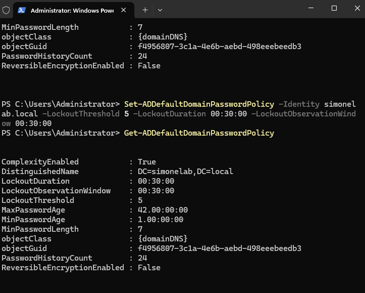
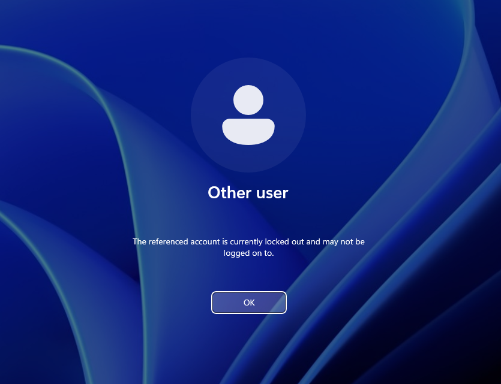
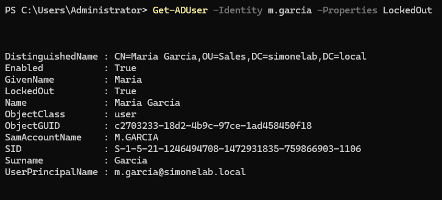
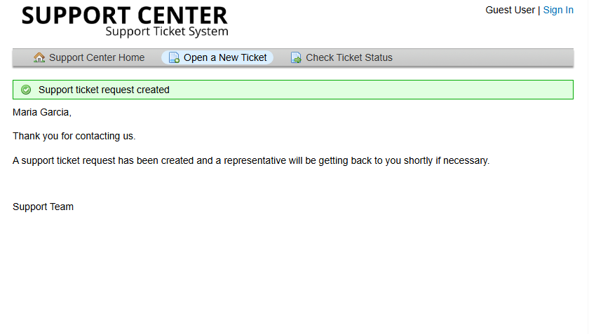
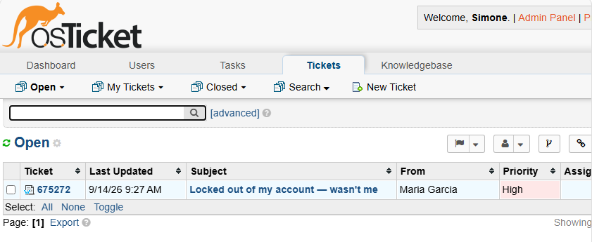
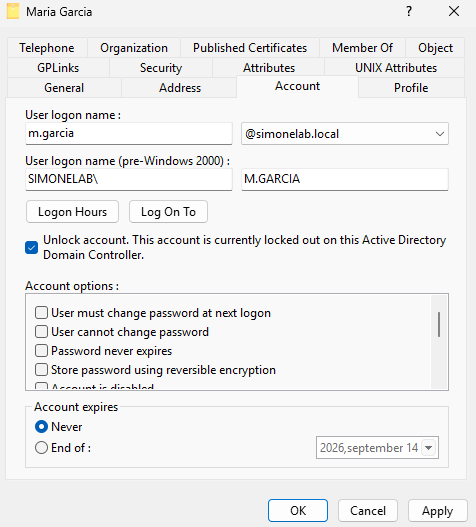

# Ticket 002 — Account Lockout

**Category:** Password/Account
**Priority:** High
**SLA:** Urgent (4hr grace period)
**Requester:** Maria Garcia (Sales)
**Status:** Resolved

---

## Reported issue

Maria Garcia's account locked out after repeated failed login attempts.
Notably, she reported she had not attempted to log in herself that day,
raising a possible security concern rather than a routine "forgot
password" situation.

> "Hi, I'm trying to log into my computer and it says my account is
> locked out after too many failed attempts. I haven't tried logging in
> today at all — I don't know who was trying to get into my account.
> Can someone look into this? — Maria"

---

## Diagnostic steps

1. Confirmed the account lockout policy was active domain-wide
   (5 failed attempts triggers a lockout).
2. Reviewed the ticket and noted Maria's claim that the attempts
   weren't hers — treated this as a possible security concern rather
   than a routine unlock request.
3. Checked failed logon details (`BadLogonCount`,
   `LastBadPasswordAttempt`) via PowerShell on the domain controller to
   get more context before acting.
4. Replied to Maria requesting confirmation of her last known login
   activity before proceeding with the unlock.

## Resolution

1. Reviewed available lockout data — nothing indicated a broader
   compromise, but the concern was taken seriously rather than
   dismissed.
2. Unlocked the account via OpenRSAT (Account properties → Unlock).
3. Replied to Maria confirming the unlock, and flagged that if this
   recurred, a password change would be the next precaution.
4. Marked the ticket Resolved.
5. Verified the fix by logging into the end-user workstation as
   `m.garcia` with her correct password, confirming successful login.

## Notes

- This ticket was deliberately built around a security-awareness
  scenario rather than a routine lockout — not every unlock request
  should be treated the same way. A user stating they didn't cause the
  lockout themselves is a signal worth checking, not ignoring.
- Domain lockout policy was not enabled by default in this lab
  environment and had to be explicitly configured
  (`Set-ADDefaultDomainPasswordPolicy`) before a real lockout could
  even occur — documented here as it's a genuinely easy thing to miss
  in a fresh AD environment.
- This ticket correctly routed through the **Access Issue** help topic
  configured earlier, auto-applying High priority and the URGENT SLA —
  confirms that configuration works correctly under a real ticket, not
  just in testing.

## Screenshots

| Step | Screenshot |
|---|---|
| Lockout policy enabled/confirmed | `ticket-002-lockout-policy.png` |
| Account locked on login screen | `ticket-002-locked-screen.png` |
| Lockout confirmed via AD | `ticket-002-lockedout-confirmed.png` |
| Ticket submitted | `ticket-002-submit.png` |
| Ticket in queue (High/Urgent SLA) | `ticket-002-queue.png` |
| Security-aware acknowledgement | `ticket-002-security-note.png` |
| Failed attempt details reviewed | `ticket-002-badpwd-check.png` |
| Account unlocked | `ticket-002-unlock.png` |
| Ticket resolved | `ticket-002-resolved.png` |
| Fix verified — successful login | `ticket-002-verified.png` |

