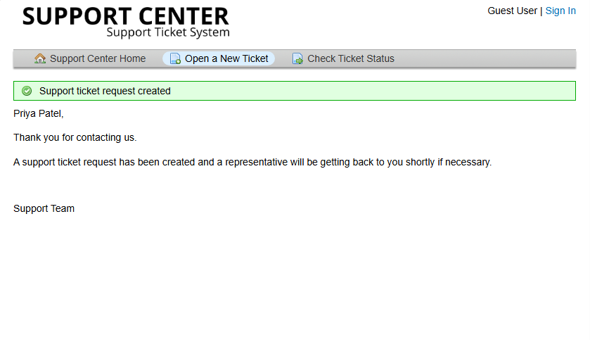
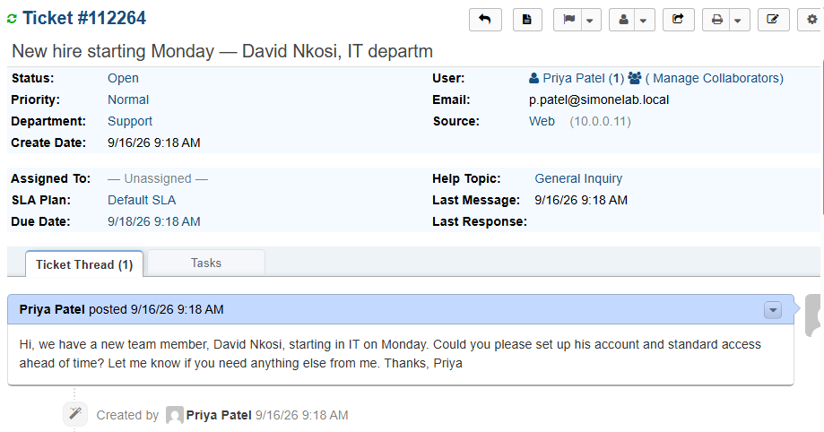
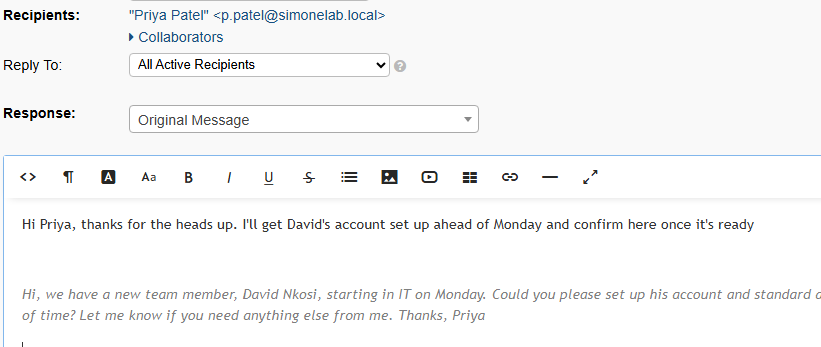
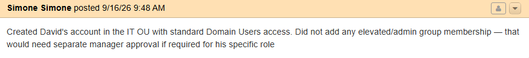
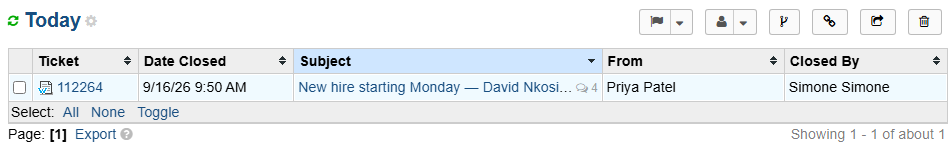

# Ticket 003 — New Hire Onboarding

**Category:** Onboarding
**Priority:** Normal
**SLA:** Default
**Requester:** Priya Patel (IT, on behalf of new hire David Nkosi)
**Status:** Resolved

---

## Reported issue

Priya Patel, an IT team member, submitted a request ahead of a new
hire's start date to have an Active Directory account and standard
access set up in advance of their first day.

> "Hi, we have a new team member, David Nkosi, starting in IT on
> Monday. Could you please set up his account and standard access
> ahead of time? Let me know if you need anything else from me.
> Thanks, Priya"

## Diagnostic steps

1. Reviewed the request and confirmed the correct department (IT).
2. Connected to the domain via OpenRSAT.
3. Confirmed the correct OU (IT) to place the new account in.

## Resolution

1. Created a new AD user account for David Nkosi (`d.nkosi`) under the
   IT organizational unit, with a temporary password and "User must
   change password at next logon" enabled.
2. Created a new "IT Staff" security group (Global, Security scope),
   since no department-specific security groups existed in the domain
   prior to this ticket — only default Windows built-in groups.
3. Added David to the IT Staff group.
4. Documented the access reasoning directly in the ticket.
5. Replied to Priya confirming the account was ready.
6. Marked the ticket Resolved.
7. Verified the account end-to-end on the end-user workstation.

## Notes

- No department-specific security groups existed in this environment
  before this ticket — only Windows built-in groups. Creating "IT
  Staff" addressed a real gap rather than working around it.
- Access was scoped deliberately — standard IT Staff group membership
  only, no elevated/admin access, consistent with least-privilege
  practice.
- No credentials were shared through the ticket thread itself.

## Screenshots

| Step | Screenshot |
|---|---|
| Ticket submitted | `ticket-0031-submit.png` |
| Ticket in queue | `ticket-0032-queue.png` |
| Acknowledgement | `ticket-0033-acknowledge.png` |
| AD account created (IT OU) | `ticket-0034-ad-account-created.png` |
| Group membership reviewed | `ticket-0035-group-membership.png` |
| Access reasoning documented | `ticket-0036-access-notes.png` |
| Ticket resolved | `ticket-0037-resolved.png` |
| Fix verified — successful login | `ticket-0038-verified.png` |

