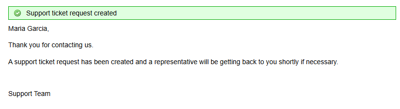
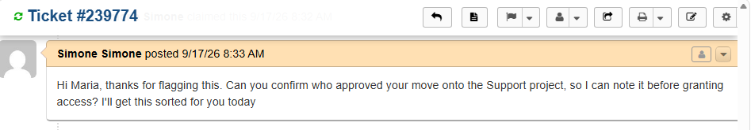
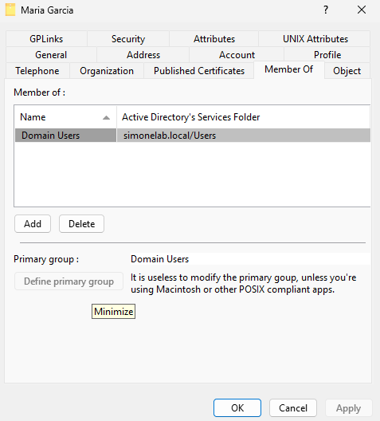
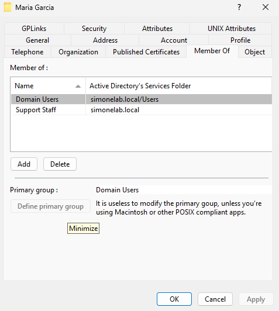
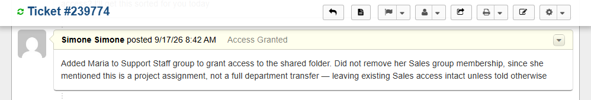
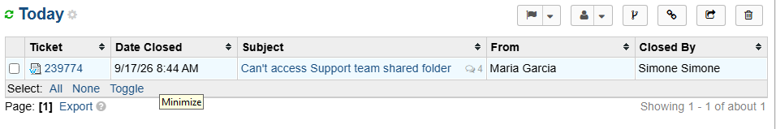
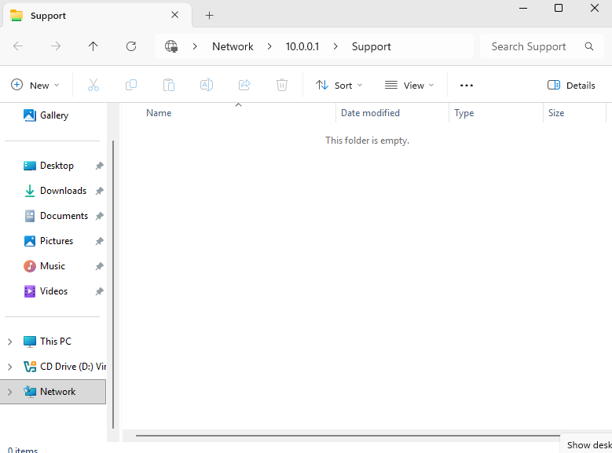

# Ticket 004 — Access Denied on Shared Drive

**Category:** Access/Permissions
**Priority:** Normal
**SLA:** Default
**Requester:** Maria Garcia (Sales)
**Status:** Resolved

---

## Reported issue

Maria Garcia, a Sales team member temporarily assigned to a Support
team project, reported she could not access the Support team's shared
folder, receiving an "Access Denied" error.

> "Hi, I was just moved onto a project with the Support team and I
> need access to their shared folder, but I get 'Access Denied' when
> I try to open it. Can someone grant me access? Thanks, Maria"

## Diagnostic steps

1. Reviewed the ticket and confirmed the context of the request
   (temporary project assignment, not a full department transfer)
   before making any access changes.
2. Connected to the domain via OpenRSAT and reviewed Maria's current
   group memberships — confirmed she was not a member of the Support
   Staff security group.
3. Investigated the shared folder itself
   (`C:\Shares\Support`, shared as `\\10.0.0.1\Support`) and its
   existing permission structure.

## Resolution

1. Added Maria to the **Support Staff** security group via OpenRSAT
   (Member Of → Add). Deliberately did **not** remove her existing
   Sales group membership, since this was a project assignment rather
   than a department transfer — she still needs her original access.
2. Documented this reasoning directly in the ticket.
3. Replied to Maria confirming the change and clarifying it was
   additive, not a replacement of her existing access.
4. Marked the ticket Resolved.
5. **Verified the fix — and found a second issue.** Testing access
   from the end-user side failed initially with a network-level
   "Windows cannot access \\10.0.0.1\Support" error, despite correct
   NTFS permissions being in place on the folder.
6. Root cause: Windows network shares have **two separate permission
   layers** — the share-level permission (who can connect to the share
   at all) and the NTFS permission (what they can do once connected).
   The share itself had only ever been granted to Domain Admins at
   creation time; NTFS permissions alone weren't enough.
7. Granted the Support Staff group **Change** access at the share
   level (`Grant-SmbShareAccess`), in addition to the existing NTFS
   Modify permission.
8. Re-tested from the end-user workstation — access confirmed working
   correctly.

## Notes

- This ticket surfaced a genuine two-layer permissions issue that's a
  common real-world gotcha: NTFS permissions alone do not grant share
  access if the share-level permissions don't also allow it. Both have
  to line up.
- Access was scoped additively rather than replacing Maria's existing
  Sales access, since the request was for a temporary project, not a
  permanent role change — a deliberate least-disruption choice.
- Verifying from the actual end-user side (rather than stopping once
  the AD group was updated) is what caught this — a good example of
  why "it looks right in the admin tool" isn't the same as "it works
  for the user."

## Screenshots

| Step | Screenshot |
|---|---|
| Ticket submitted | `ticket-004-submit.png` |
| Ticket in queue | `ticket-004-queue.png` |
| Acknowledgement | `ticket-004-acknowledge.png` |
| Maria's current access reviewed | `ticket-004-current-access.png` |
| Support Staff group added | `ticket-004-group-added.png` |
| Access reasoning documented | `ticket-004-access-reasoning.png` |
| Ticket resolved | `ticket-004-resolved.png` |
| Fix verified — folder access confirmed | `ticket-004-verified.png` |

