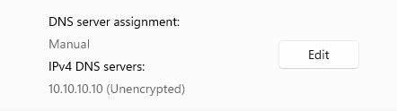
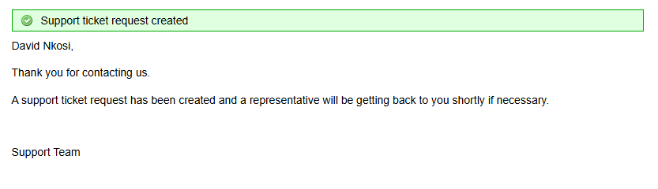
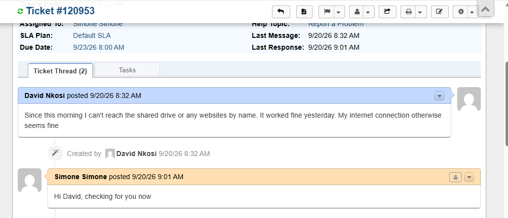
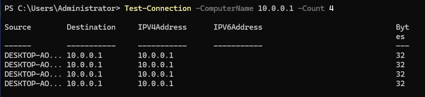
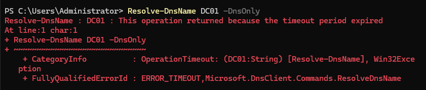
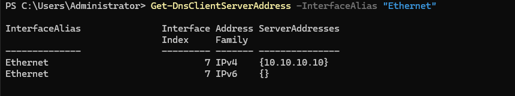
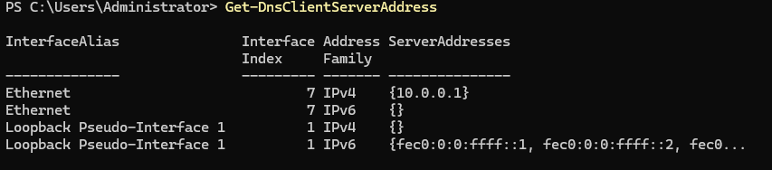
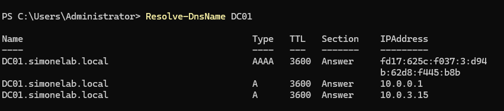
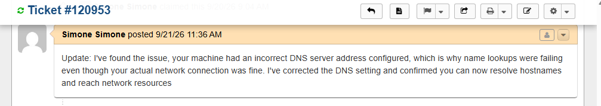

# Ticket 005 — Network Connectivity Loss

**Category:** Network
**Priority:** High
**SLA:** Urgent
**Requester:** David Nkosi (ENDUSER01)
**Status:** Resolved

---

## Reported issue

David Nkosi reported he could not reach any network resources by
name — the shared drive and websites both failed to load, though the
issue had not been present the previous day.

> "Hi, I haven't tried an IP address — I wouldn't know one to try!
> It's affecting everything though, I can't get to the shared drive
> and websites don't load either."

## Diagnostic steps

1. Confirmed IP-layer connectivity was intact by pinging DC01 directly by IP address (`Test-Connection -ComputerName 10.0.0.1 -Count 4`) — succeeded with 0% packet loss, ruling out a physical/routing fault.
2. Attempted to resolve DC01 by hostname (`ping DC01`, `Resolve-DnsName DC01`) — initially returned successful results even with the fault present, due to Windows falling back to LLMNR (link-local multicast name resolution) on the same subnet.
3. Forced a DNS-only lookup (`Resolve-DnsName DC01 -DnsOnly`) to bypass the LLMNR fallback and query the configured DNS server directly — this returned a timeout, confirming the fault was isolated to the configured DNS server itself.
4. Checked the client's DNS configuration (`Get-DnsClientServerAddress -InterfaceAlias "Ethernet"`) — confirmed the Preferred DNS server was set to an invalid address (`10.10.10.10`) instead of DC01's actual IP (`10.0.0.1`).
5. Verified DC01's DNS service health directly on the server (`Get-Service DNS, NTDS, ADWS`, local `nslookup`) to rule out a server-side cause — all services were running and DC01 could resolve itself without issue.
6. Checked port-level reachability (`Test-NetConnection -ComputerName 10.0.0.1 -Port 53`) — confirmed DNS traffic (port 53) was reaching DC01 without being blocked, isolating the fault to the client-side DNS configuration only.

## Resolution

Corrected the client's DNS server address back to DC01's IP:

```powershell
Set-DnsClientServerAddress -InterfaceAlias "Ethernet" -ServerAddresses "10.0.0.1"
Clear-DnsClientCache
```

Verified the fix with `Get-DnsClientServerAddress` (confirmed `10.0.0.1` applied) and `Resolve-DnsName DC01` (resolved successfully). Confirmed with the end user that the shared drive and other name-based resources were accessible again.

## Notes

- **LLMNR fallback observed:** During testing, standard `ping`/`Resolve-DnsName` calls returned successful results even while the DNS misconfiguration was active, because Windows silently fell back to LLMNR on the local subnet. Using the `-DnsOnly` flag was necessary to get an accurate test of the actual DNS path. Worth remembering for future network tickets — a passing ping/resolve doesn't always mean DNS itself is healthy on a local subnet.
- **Intermittent SERVER_FAILURE during final verification:** After the fix was applied, a `-DnsOnly` verification query intermittently returned `RCODE_SERVER_FAILURE` despite DC01's DNS service, AD DS, and ADWS all confirmed healthy and port 53 reachable. Root cause assessed as resource contention from running multiple VMs simultaneously on a 2-core lab host, rather than a genuine DNS fault. Standard (non-`-DnsOnly`) verification resolved cleanly and consistently, confirming the fix was correct.

## Screenshots

| Step | Screenshot |
|---|---|
| DNS fault planted | `ticket005-01-fault-planted.png` |
| Ticket submitted | `ticket005-02-ticket-submitted.png` |
| Intake thread exchange | `ticket005-02b-thread-exchange.png` |
| IP-level ping success | `ticket005-03-ping-ip-success.png` |
| DNS resolution failure confirmed | `ticket005-04-dns-failure.png` |
| Root cause — misconfigured DNS server | `ticket005-05-root-cause.png` |
| Fix applied — DNS corrected | `ticket005-06-fix-applied.png` |
| Resolution confirmed | `ticket005-07-resolution-confirmed.png` |
| Ticket closed | `ticket005-08-ticket-closed.png` |










