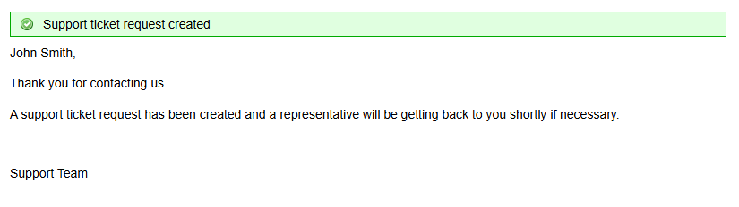
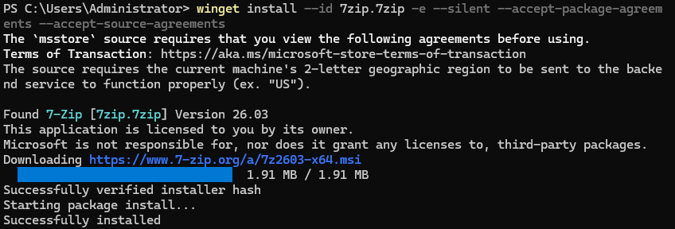
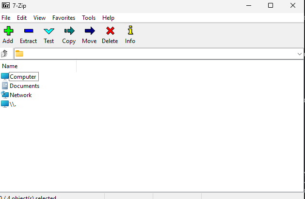
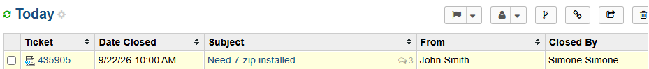

# Ticket 006 — Software Install Request

**Category:** Software
**Priority:** Low
**SLA:** Default
**Requester:** J. Smith (ENDUSER01)
**Status:** Resolved

---

## Reported issue

J. Smith requested 7-Zip be installed on their workstation ahead of a new project requiring archive extraction.

> "Hi, I need 7-Zip installed for a project I'm starting — need to extract some archive files. Thanks!"

## Diagnostic steps

1. Reviewed the request and confirmed it was a standard, low-risk software install — no approval chain required in this environment, but noted the assumption in the ticket for documentation purposes.
2. Confirmed `winget` (Windows Package Manager) was available on ENDUSER01 before proceeding, avoiding a manual installer download.

## Resolution

1. Installed 7-Zip silently via winget, with no user interaction required:

```powershell
winget install --id 7zip.7zip -e --silent --accept-package-agreements --accept-source-agreements
```

2. Verified the installation and confirmed the application launches correctly:

```powershell
Get-Command "C:\Program Files\7-Zip\7zFM.exe"
Start-Process "C:\Program Files\7-Zip\7zFM.exe"
```

3. Replied to the ticket confirming installation and closed it once the end user confirmed.

## Notes

- Used `winget` instead of a manual `.exe` installer to keep the process fast, silent, and scriptable — reflects how a real technician would handle a routine, high-volume request type rather than clicking through a GUI wizard each time.
- No AD/DC involvement needed for this ticket, so DC01 was left powered off during the exercise to minimize lab host resource usage.

## Screenshots

| Step | Screenshot |
|---|---|
| Ticket submitted | `ticket006-01-ticket-submitted.png` |
| Install command run | `ticket006-02-install-command.png` |
| Launch confirmed | `ticket006-03-launch-confirmed.png` |
| Ticket closed | `ticket006-04-ticket-closed.png` |





