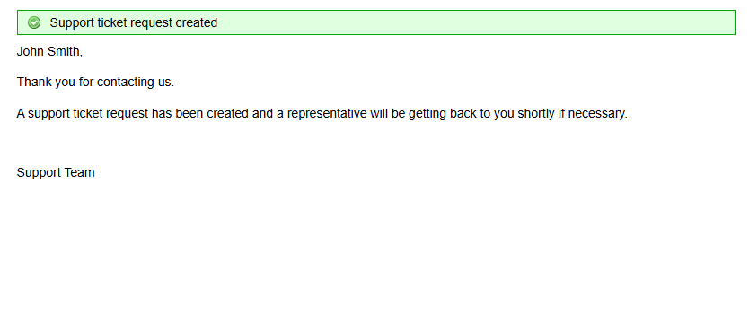
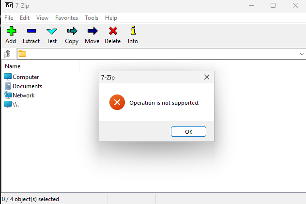
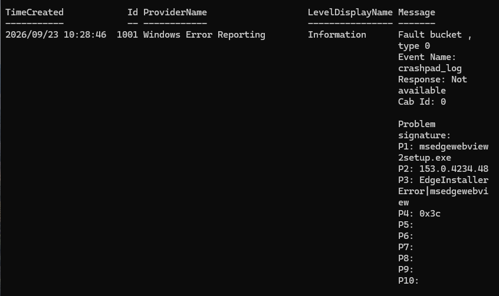
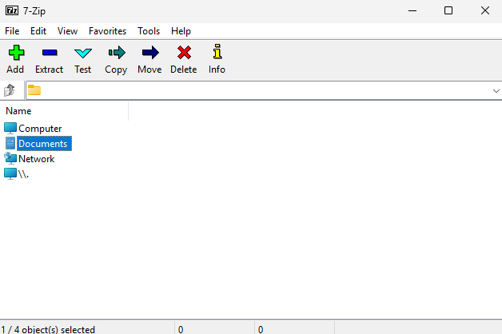

# Ticket 007 — Application Crash After Update

**Category:** Software
**Priority:** Normal
**SLA:** Default
**Requester:** J. Smith (ENDUSER01)
**Status:** Resolved

---

## Reported issue

J. Smith reported that 7-Zip stopped working correctly, and suspected it was related to a recent Windows Update.

> "7-Zip won't open anymore — worked fine yesterday. I think it happened after the last Windows Update installed."

## Diagnostic steps

1. Attempted to launch 7-Zip (`7zFM.exe`) to observe the actual symptom firsthand rather than relying solely on the user's description. The application window opened normally, but attempting to interact with archive contents returned an **"Operation is not supported"** error — a partial failure rather than a hard crash, meaning the app appeared functional at first glance.
2. Checked Event Viewer (Application log) for any entries around the time of the error — none were found. This is consistent with 7-Zip handling the missing dependency internally via its own error dialog, rather than triggering a Windows-level application fault that would be logged.
3. Ruled out a permissions-related cause by relaunching 7-Zip as Administrator and reproducing the same action — the identical error occurred, confirming this wasn't a permissions issue.
4. Checked for a pending application update (`winget upgrade --id 7zip.7zip`) — none was pending, ruling out an incomplete/failed auto-update as the cause.
5. With the simpler causes ruled out, inspected the application's installed files directly and found `7z.dll` — a file the application depends on for archive operations — was missing from the install directory.

## Resolution

Restored the missing dependency file:

```powershell
Rename-Item "C:\Program Files\7-Zip\7z.dll.bak" "7z.dll"
```

Relaunched 7-Zip and confirmed archive browsing/interaction worked correctly with no error. Confirmed with the end user that the application was fully functional again.

## Notes

- **Troubleshooting order:** deliberately checked the simplest, least invasive causes first (reproduce the issue, check logs, rule out permissions, rule out pending updates) before inspecting installed files directly — avoids jumping to a file-level fix without first eliminating more common causes.
- **Partial failure vs. hard crash:** this ticket presented as a partial functional failure rather than an outright crash, which made it slightly less obvious than "the app won't open at all." Worth noting for future tickets that a symptom description from a user ("it won't open") doesn't always match the precise technical behavior observed firsthand.
- **Empty Event Viewer result is still a valid diagnostic step** — confirming nothing was logged ruled out a category of causes (OS-level application faults) just as usefully as finding an error would have.

## Screenshots

| Step | Screenshot |
|---|---|
| Fault planted (dependency file removed) | `ticket007-01-fault-planted.png` |
| Ticket submitted | `ticket007-02-ticket-submitted.png` |
| Launch attempt — error reproduced | `ticket007-03-launch-attempt.png` |
| Event Viewer checked — no entries found | `ticket007-04-event-viewer.png` |
| Permissions ruled out (Run as Administrator) | `ticket007-05-runas-attempt.png` |
| Pending update check | `ticket007-06-update-check.png` |
| Fix applied | `ticket007-07-fix-applied.png` |
| Fix verified | `ticket007-08-verified.png` |
| Ticket closed | `ticket007-09-ticket-closed.png` |









