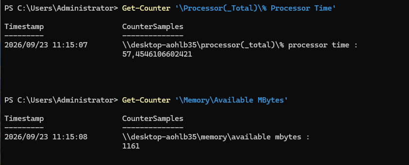
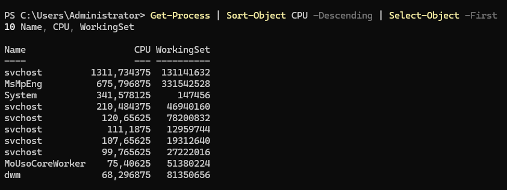
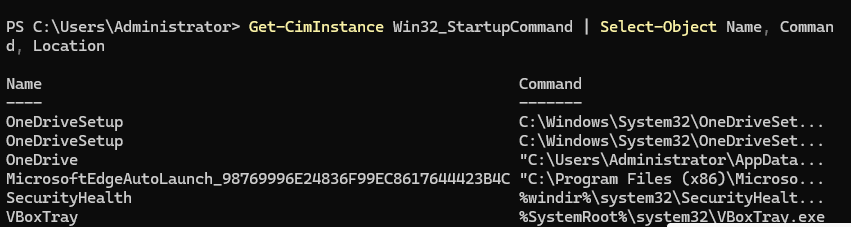
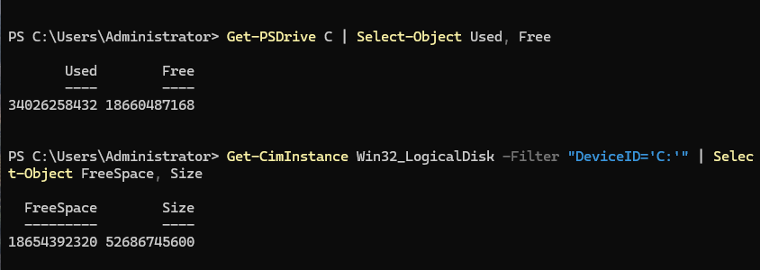
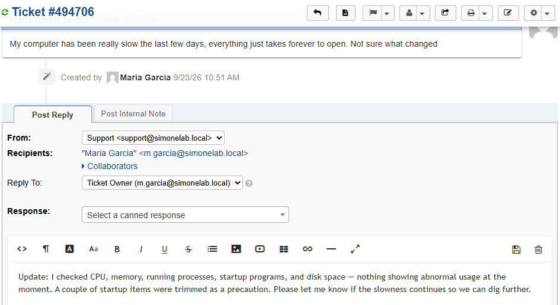

# Ticket 008 — Slow Computer Performance

**Category:** Performance
**Priority:** Low
**SLA:** Default
**Requester:** M. Garcia (ENDUSER01)
**Status:** Resolved

---

## Reported issue

M. Garcia reported general slowness on her workstation over the preceding few days, with no specific application or trigger identified.

> "My computer has been really slow the last few days, everything just takes forever to open. Not sure what changed."

## Diagnostic steps

1. Checked overall system resource usage (`Get-Counter '\Processor(_Total)\% Processor Time'`, `Get-Counter '\Memory\Available MBytes'`) to get a baseline read on CPU load and available memory — nothing abnormal observed.
2. Identified the top resource-consuming processes (`Get-Process | Sort-Object CPU -Descending | Select-Object -First 10`) to check for any single runaway application — no outliers found.
3. Reviewed startup programs (`Get-CimInstance Win32_StartupCommand`) to check for unnecessary applications launching at boot, a common and often-overlooked contributor to gradual slowdown.
4. Checked available disk space (`Get-PSDrive C`, `Get-CimInstance Win32_LogicalDisk`) to rule out a nearly-full disk as a cause — space was not a concern.

## Resolution

No single root cause was identified from CPU, memory, process, or disk checks at the time of investigation. As a precaution, trimmed non-essential entries from startup programs to reduce boot-time and background resource load. Advised the end user to report back if the slowness persists so further monitoring or a deeper investigation (e.g. over a longer observation window) can be scheduled.

## Notes

- **Vague complaints are still worth a structured process.** Without a reproducible fault, the goal shifted from "find and fix the bug" to "systematically rule out the common causes and document the findings" — a realistic and common L1 outcome, not every ticket resolves with a dramatic root cause.
- **No abnormal findings is still a valid, professional resolution** when paired with clear documentation of what was checked and a plan for follow-up if the issue recurs, rather than closing the ticket with no explanation.

## Screenshots

| Step | Screenshot |
|---|---|
| Ticket submitted | `ticket008-01-ticket-submitted.png` |
| CPU/memory resource snapshot | `ticket008-02-resource-snapshot.png` |
| Top processes by CPU | `ticket008-03-top-processes.png` |
| Startup programs reviewed | `ticket008-04-startup-programs.png` |
| Disk usage checked | `ticket008-05-disk-usage.png` |
| Ticket closed | `ticket008-06-ticket-closed.png` |

