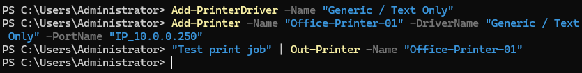
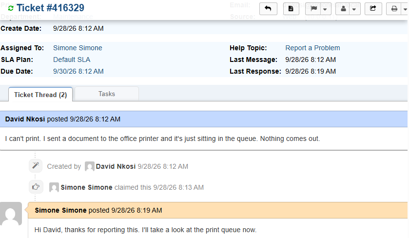
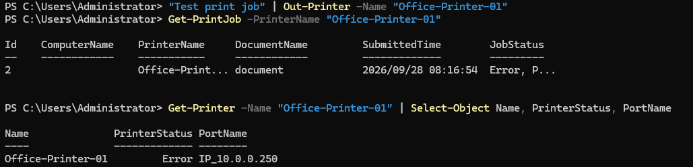
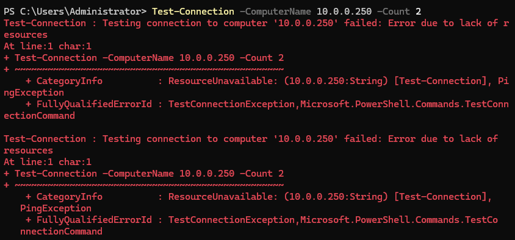
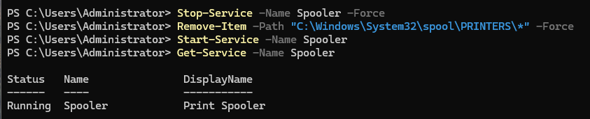
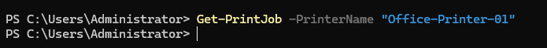
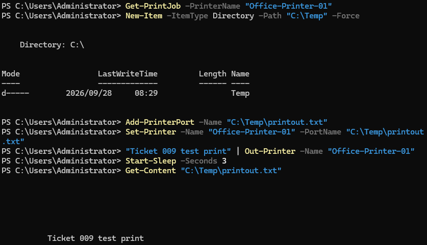

# Ticket 009 — Printer Not Working

**Category:** Hardware/Printing
**Priority:** Normal
**SLA:** Default
**Requester:** David Nkosi (ENDUSER01)
**Status:** Resolved

---

## Reported issue

David Nkosi reported he could not print. A document sent to the office printer stayed in the queue and nothing was produced.

> "I can't print. I sent a document to the office printer and it's just sitting in the queue. Nothing comes out."

## Diagnostic steps

1. Checked the print queue and printer status (`Get-PrintJob`, `Get-Printer`). The document was stuck in the queue with an **Error** status, and the printer itself also reported an Error status against port `IP_10.0.0.250`.
2. Tested whether the printer was reachable on the network (`Test-Connection -ComputerName 10.0.0.250`). There was no response, indicating the device was offline or unreachable rather than the job simply being slow.
3. Concluded the stuck job was a symptom of the unreachable printer. Because a job that cannot be delivered stays in the queue and can block later jobs, the queue needed clearing once the device issue was addressed.

## Resolution

1. Cleared the print spooler by stopping the service, deleting the queued spool files, and restarting it:

```powershell
Stop-Service -Name Spooler -Force
Remove-Item -Path "C:\Windows\System32\spool\PRINTERS\*" -Force
Start-Service -Name Spooler
```

2. Confirmed the Spooler service was running again and that the stuck job was gone from the queue (`Get-PrintJob` returned no results).
3. Redirected the printer to a working destination and sent a test job, which completed and left the queue.
4. Confirmed with the end user that printing was working again.

## Notes

- **Lab limitation:** this lab has no physical printer. The fault was reproduced with a virtual printer pointed at an IP address with nothing behind it, so the stuck queue and the spooler fix are live results from this environment. The final "reconnect" step was simulated by pointing the printer at a local file port, because the real fix for an unreachable printer (checking its power and network connection) cannot be performed in a VM.
- **In a live environment**, the next steps after clearing the queue would be checking the printer's power and network cable, confirming its IP address has not changed, and escalating to the network team if the device stays unreachable.
- Clearing the spooler resolves a stuck queue but does not fix an unreachable printer. Testing reachability first is what separated the two problems.

## Screenshots

| Step | Screenshot |
|---|---|
| Fault planted (printer on unreachable port) | `ticket009-01-fault-planted.png` |
| Ticket submitted | `ticket009-02-ticket-submitted.png` |
| Print job stuck in queue | `ticket009-03-queue-stuck.png` |
| Printer unreachable | `ticket009-04-printer-unreachable.png` |
| Spooler cleared | `ticket009-05-spooler-cleared.png` |
| Queue confirmed empty | `ticket009-06-queue-empty.png` |
| Test print verified | `ticket009-07-test-print-verified.png` |
| Ticket closed | `ticket009-08-ticket-closed.png` |









