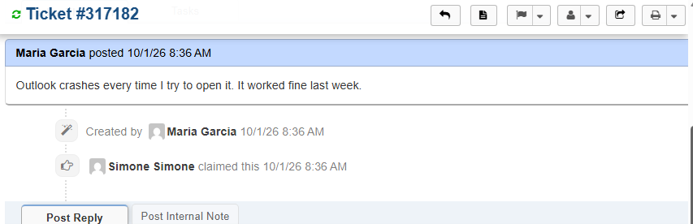
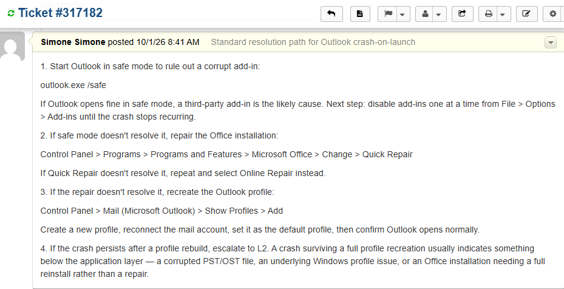
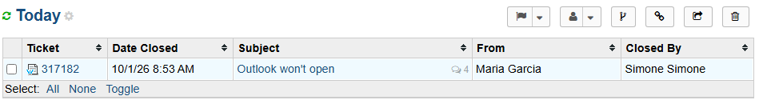

# Ticket 010 — Outlook Won't Open

**Category:** Email
**Priority:** Normal
**SLA:** Default
**Requester:** M. Garcia (ENDUSER01)
**Status:** Resolved

---

## Reported issue

M. Garcia reported that Outlook crashed every time she tried to open it, after working normally the previous week.

> "Outlook crashes every time I try to open it. It worked fine last week."

## Diagnostic steps

Documented the standard L1 resolution path for a crash-on-launch, in order from least to most invasive, rather than running live diagnostics — see **Lab limitation** below for why.

1. Start Outlook in safe mode (`outlook.exe /safe`) to rule out a corrupt add-in. If Outlook opens fine in safe mode, add-ins are disabled one at a time from **File → Options → Add-ins** until the crash stops recurring, identifying the offending add-in.
2. If safe mode doesn't resolve it, repair the Office installation via **Control Panel → Programs and Features → Microsoft Office → Change → Quick Repair**, escalating to **Online Repair** if Quick Repair doesn't resolve it.
3. If the repair doesn't resolve it, recreate the Outlook profile via **Control Panel → Mail → Show Profiles → Add**, reconnect the mail account, set the new profile as default, and confirm Outlook opens normally.
4. If the crash persists after a full profile rebuild, escalate to L2 — this usually indicates a cause below the application layer (corrupted PST/OST file, underlying Windows profile issue, or an Office installation needing a full reinstall).

## Resolution

Provided the end user with the documented troubleshooting path in order, asked her to follow it step by step, and requested she report back if the issue persisted after any stage so it could be escalated.

## Notes

- **Lab limitation:** this lab has no Office/Outlook installation and no mail server, so this ticket could not be reproduced live. The resolution path above is accurate, standard L1 reference knowledge for this exact symptom, documented honestly as a runbook rather than presented as a tested fix. Being upfront about this distinction is more credible than simulating a result that wasn't actually achievable in this environment.
- **Escalation criterion included deliberately:** rather than listing only fixes, the note specifies the point at which this moves beyond L1 scope (crash surviving a profile rebuild) and why — demonstrates judgment about when to hand off rather than keep trying fixes indefinitely.

## Screenshots

| Step | Screenshot |
|---|---|
| Ticket submitted | `ticket010-01-ticket-submitted.png` |
| Resolution path documented (internal note) | `ticket010-03-resolution-notes.png` |
| Ticket closed | `ticket010-04-ticket-closed.png` |

