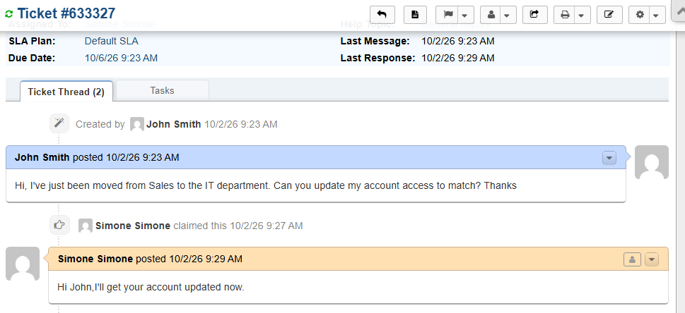
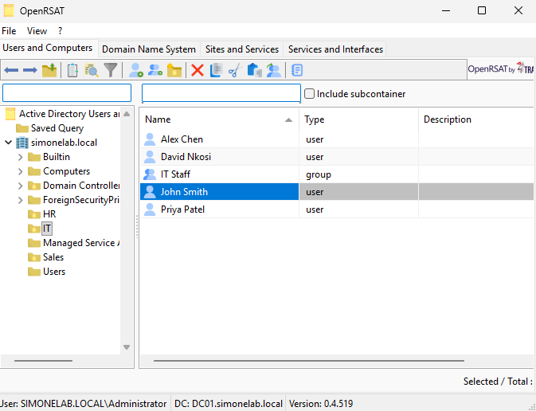
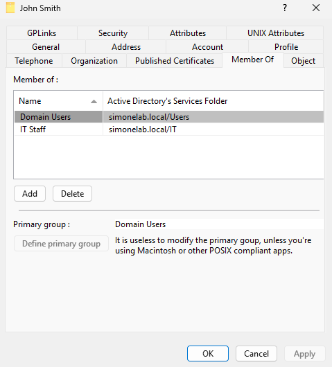
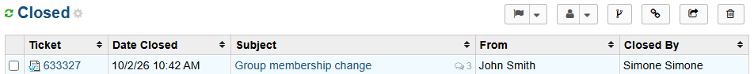

# Ticket 011 — Group Membership Change (Department Transfer)

**Category:** Access/Permissions
**Priority:** Normal
**SLA:** Default
**Requester:** John Smith (ENDUSER01)
**Status:** Resolved

---

## Reported issue

John Smith reported he had been transferred from the Sales department to IT and needed his account access updated to match.

> "Hi, I've just been moved from Sales to the IT department. Can you update my account access to match? Thanks."

## Diagnostic steps

1. Reviewed John Smith's current state in Active Directory before making changes — confirmed his account sat in the Sales OU and held membership in the Sales Staff security group, in addition to the default Domain Users group.
2. Identified that this was a full department transfer rather than a temporary project assignment, meaning old access needed to be removed, not just new access added — a different approach from Ticket 004's additive change.

## Resolution

1. Moved John Smith's Active Directory object from the Sales OU to the IT OU — a distinct action from group membership, since an OU move alone does not change group access.
2. Removed his membership from the Sales Staff security group and added him to the IT Staff security group.
3. Confirmed his Member Of list showed Sales Staff removed and IT Staff added, with his OU correctly reflecting IT.
4. Replied to the end user confirming the change and closed the ticket once he confirmed.

## Notes

- **OU moves and group membership are separate mechanisms in Active Directory** — moving an object to a new OU does not automatically update its group memberships, and vice versa. Both had to be handled explicitly for this transfer to be complete.
- **Full transfer vs. additive access:** this ticket deliberately removed the user's old Sales Staff access rather than leaving it in place, since the request was a permanent department move. Contrast with Ticket 004, where access was added without removing the original Sales membership, because that request was a temporary project assignment, not a transfer.

## Screenshots

| Step | Screenshot |
|---|---|
| Ticket submitted | `ticket011-01-ticket-submitted.png` |
| Current state reviewed (Sales OU, Sales Staff group) | `ticket011-02-current-state.png` |
| OU moved to IT | `ticket011-03-ou-moved.png` |
| Group membership updated (Sales Staff removed, IT Staff added) | `ticket011-04-groups-updated.png` |
| Ticket closed | `ticket011-05-ticket-closed.png` |

